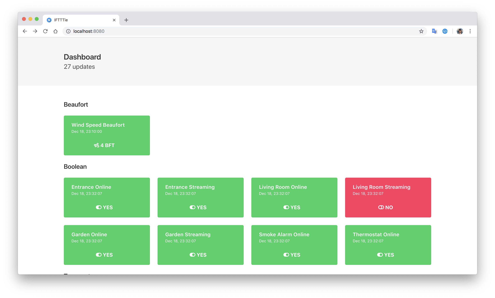

# IFFTTie

This is yet another home automation service.


## Web interface



## Why not [Home Assistant](https://www.home-assistant.io/) or [OpenHAB](https://www.openhab.org/)?

There're multiple reasons why I didn't like them:

- Quite heavy. Their restart or configuration update takes ages.
- I can't catch all those _things_, _entities_, _channels_ and etc and relations between them. I want something simpler.
- Too flexible. While this may be good, I'm getting tired configuring all those _things_.
- Custom automation syntax. This may be perfect for non-developers, but I prefer to write in [my favorite language](https://www.python.org/).
- Inconvenient configuration. It's stored inside a container, separate web interfaces are needed to edit it via browser.

## General idea

In IFFTTie there're only **two** terms to understand: *service* and *update*.

### What's a *service*?

*Service* is an interface to the outside world. It serves two goals:

- You control the outside world with its public methods.
- It generates *updates*.

#### Examples

- [Nest API](https://developers.nest.com/documentation/api-reference)
- [Buienradar](https://www.buienradar.nl/)
- [IFFTT](https://ifttt.com/maker_webhooks)

### What's *update*?

The term stands for itself. Update contains information that something has changed in the world. An update consists of a *key* and a *value*. *Key* is a globally unique identifier which is used to refer to a particular *value* in the world.

#### Examples

| key                                  | value     |
| ------------------------------------ | --------- |
| `buienradar:6391:temperature`        | `2.8`     |
| `nest:camera:0123…9876:is_streaming` | `true`    |
| `webhook:hello`                      | `'world'` |

## Configuration

IFTTTie reads its configuration from a single file. And there're two important things:

- It's **non-local**. You pass a **URL** via command line parameter or environment variable. IFTTTie loads the file when (re-)started. Think here of a secret [Gist](https://gist.github.com/) URL, for example. **Never share your configuration publicly as soon as it contains any credentials.**
- It's a **Python module**. You can write any valid Python code in there. IFTTTie Python API is described further. **Don't blindly trust others' code.**

## Running

### Via command line

```text
Usage: iftttie [OPTIONS]

  Yet another home assistant.

Options:
  -c, --config TEXT    Configuration URL.  [required]
  --http-port INTEGER  Web server port.  [default: 8080]
  -v, --verbose        Logging verbosity.
  --help               Show this message and exit.
```

### Via Docker

```bash
docker run -it --rm eigenein/iftttie iftttie -vvv -c https://gist.githubusercontent.com/user/repo/raw
```

The image supports running on Raspberry Pi out-of-the-box. With useful flags:

```bash
touch iftttie.sqlite3
docker run \
    --detach \
    --restart always \
    --name iftttie \
    -p 8080:8080 \
    -v /home/pi/iftttie.sqlite3:/app/db.sqlite3 \
    -e TZ=Europe/Amsterdam
    eigenein/iftttie -vvv -c https://gist.githubusercontent.com/user/repo/raw
```

## Startup

At its (re-)start, IFTTTie imports the configuration module. Then, it starts all services specified in `services` module attribute.

The following function from the imported module will be run for every update:

```python
from iftttie.dataclasses_ import Update


# Name must be `on_update`.
async def on_update(update: Update):
    ...
```

### Configuration example

```python
from datetime import timedelta

from iftttie.dataclasses_ import Update
from iftttie.services.buienradar import Buienradar
from iftttie.services.clock import Clock
from iftttie.services.nest import Nest

nest = Nest(NEST_TOKEN)
clock = Clock('hello', timedelta(seconds=1.0))
buienradar = Buienradar(BUIENRADAR_STATION_ID)

services = [nest, clock, buienradar]
display_names = {
    f'buienradar:{BUIENRADAR_STATION_ID}:humidity': 'Humidity',
    f'buienradar:{BUIENRADAR_STATION_ID}:feel_temperature': 'Feels',
    f'buienradar:{BUIENRADAR_STATION_ID}:ground_temperature': 'Ground',
    f'buienradar:{BUIENRADAR_STATION_ID}:temperature': 'Temperature',
    f'nest:camera:{LIVING_ROOM_CAMERA_ID}:is_streaming': 'Living Room Streaming',
    f'nest:camera:{LIVING_ROOM_CAMERA_ID}:is_online': 'Living Room Online',
}


async def on_update(update: Update):
    print(update)
```

## Recipes

This section aims to demonstrate different practical examples of IFTTTie configuration.

### Display names

If you add `display_name: Dict[str, str]` attribute to your configuration, it will be used to replace long and ugly identifiers in the web interface.

For instance:

```python
display_name = {
    f'buienradar:{BUIENRADAR_STATION_ID}:humidity': 'Humidity',
}
```

## Python API

### `iftttie.dataclasses_.Update`

#### `key: str`

This is just update *key* that's described above.

#### `value: Any`

The related *value*. Very specific to a particular service.

#### `timestamp: datetime`

Time and date when the event has occurred.

#### `kind: ValueKind`

Specifies what this value is. For instance, `ValueKind.TEMPERATURE` or `ValueKind.ON_OFF`.

### Service classes

#### `iftttie.services.clock.Clock`

Yields periodical events with the specified `key`. Value then increments by one from zero on every tick.

```python
def __init__(self, key: str, interval: timedelta):
    ...
```

##### Example configuration

```python
from datetime import timedelta

from iftttie.services.clock import Clock

clock = Clock('hello', timedelta(seconds=1.0))
```

##### Example output

```text
Nov 17 00:09:03 (iftttie.core:54) [D] Requesting updates from Clock(key='hello', interval=1.0)…
Nov 17 00:09:04 (iftttie.core:83) [S] clock:hello = 219
```

#### `iftttie.services.nest.Nest`

Yields events from your Nest structure.

```python
def __init__(self, token: str):
    ...
```

#### `iftttie.services.buienradar.Buienradar`

Yields weather information from Dutch [Buienradar](https://www.buienradar.nl/) service.

```python
def __init__(self, station_id: int, interval=timedelta(seconds=300.0)):
    ...
```

##### Example configuration

```python
from iftttie.services.buienradar import Buienradar

buienradar = Buienradar(6240)
```

##### Example output

```text
Nov 17 00:18:02 (iftttie.core:83) [S] buienradar:6240:air_pressure = 1012.19
Nov 17 00:18:02 (iftttie.core:83) [S] buienradar:6240:feel_temperature = -1.5
Nov 17 00:18:02 (iftttie.core:83) [S] buienradar:6240:ground_temperature = 3.2
Nov 17 00:18:02 (iftttie.core:83) [S] buienradar:6240:humidity = 97.0
Nov 17 00:18:02 (iftttie.core:83) [S] buienradar:6240:temperature = 3.1
Nov 17 00:18:02 (iftttie.core:83) [S] buienradar:6240:wind_direction = 'ZZO'
Nov 17 00:18:02 (iftttie.core:83) [S] buienradar:6240:wind_speed = 5.87
Nov 17 00:18:02 (iftttie.core:83) [S] buienradar:6240:wind_speed_bft = 4
```

#### `iftttie.services.file_.File`

Periodically yields contents of the specified file.

```python
def __init__(self, path: Path, key: str, interval: timedelta, kind: ValueKind):
    ...
```

#### `iftttie.services.file_.FloatFile`

Periodically yields floating-point value from the specified file.

```python
def __init__(self, path: Path, key: str, interval: timedelta, kind: ValueKind, scale=1.0):
    ...
```

##### Example configuration

```python
from datetime import timedelta
from pathlib import Path

from iftttie.enums import ValueKind
from iftttie.services.file_ import FloatFile

cpu_temperature = FloatFile(
    Path('/sys/class/thermal/thermal_zone0/temp'), 
    'cpu_temperature', 
    timedelta(seconds=10.0),
    ValueKind.CELSIUS,
    0.001, 
)
```

## Public HTTP API

You can send custom updates to IFTTTie from outside via its public API.

TODO
